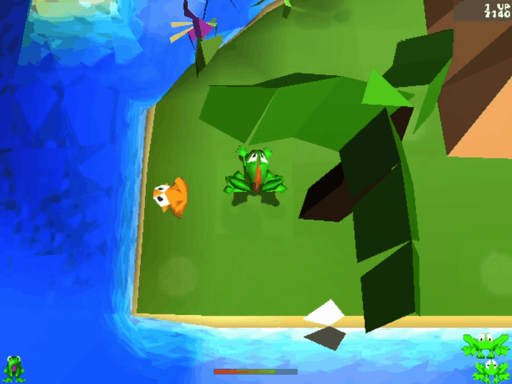

Powered by 

# Frogger He's Back Randomizer

## How does it work?
The randomizer scrambles player starting position and froglet 
locations in each level allowing you to experience the levels
from a new perspective.  Explore new paths.  Develop new
strategies.

The randomizer requires a copy of Frogger: He's Back (1997)
to run.

## How to use:
1. Make a backup of your frogger.exe and frogpsx.mwd before use.
2. Place FroggerHesBackRandomizer.exe, FroggerHesBackRandomizer.pck, 
and FrogLord.jar in a folder.
3. Launch FroggerHesBackRandomizer.exe and follow instructions

## What is FrogLord?
FrogLord is a modding suite for Frogger (1997). It allows 
fans to create new levels, import 3D models, view unused content, 
and allow changing all game files.
To use this tool, you must have a copy of the game.

## Also Visit:
https://github.com/Kneesnap/FrogLord/releases

https://highwayfrogs.net/

https://highwayfrogs.net/thread/26/discord-group

## Getting Started:
Download FrogLord [here](https://github.com/Kneesnap/FrogLord/releases).  
If you need any help, have questions, or want to get in touch, don't hesitate to talk to us on our [website](https://highwayfrogs.net/) or our [discord server](https://discord.gg/GSNCbCN).

## Join the Community: 
Need help? Want to find/share mods? Talk with other Frogger fans? Join our [discord server](https://discord.gg/GSNCbCN).

## Screenshots:

## Supported Games
| Name                     | # of Supported Builds | Support Notes                  |
|--------------------------|-----------------------|--------------------------------|
| Beast Wars: Transformers | PC: 1, PSX: 1         | Support WIP.                   |
| C-12 Final Resistance    | PSX: 16               | Support WIP.                   |
| Frogger He's Back        | PC: 6, PSX: 67        | Map editing not yet finalized. |
| Frogger: The Great Quest | PC: 1, PS2: 3         | Support WIP.                   |
| MediEvil                 | PSX: 38               | Support WIP.                   |
| MediEvil II              | PSX: 16               | Support WIP.                   |
| Moon Warrior             | PSX: 1                | Support WIP.                   |

## Build Instructions:

### Using IntelliJ and Godot 4.3

**Setup:**
1. Select ``Git`` from the ``Check out from Version Control`` option on the main menu. (It may be ``File > New > Project from Version Control`` if you're not on the main menu.)  
2. Clone this repository. 
3. Install the Lombok IntelliJ Plugin using the steps 
found [here](https://projectlombok.org/setup/intellij).

**Running:**
1. Comment out `// Save the end result` section of Randomizer.java
2. ``Run > Run 'FrogLord GUI'``  

**Building:**
1. ``Build > Build Artifacts... > FrogLord > Build``
2. Copy from `out` folder to designated release directory
3. Open HesBackRandomizerGUI with Godot
4. `Project > Export > Windows Desktop (Runnable)`
5. Update the version number and output path
6. `Export all...`

### Using Maven

**Requirements:**
1. Maven:
    - Download the latest version of [maven](https://maven.apache.org/download.cgi)
    - Follow the [installation guide](https://maven.apache.org/install.html)
2. Java JDK:
    - Make an Oracle account (Unfortunately required for the next step)
    - Download Java 8 [Java Development Kit](https://www.oracle.com/java/technologies/javase/javase8u211-later-archive-downloads.html)
    - If you downloaded a bin file run that, otherwise install according to the instructions

**Setup:**
1. ``git clone https://github.com/Kneesnap/FrogLord.git``
2. ``cd FrogLord``
3. ``mvn compile`` - Verify code compiles

**Building:**
1. ``mvn package``

**Running:**
1. ``java -jar target/editor-{version}-jar-with-dependencies.jar`` 
    * `{version}` is the current release

## Special Thanks:
 - Kneesnap (FrogLord creator who made this randomizer possible)
 - Andy Eder (Frogger 2 Programmer, Significant FrogLord contributor)
 - Mysteli (Highway Frogs Creator, Documented demo replay file format)
 - Aluigi (QuickBMS Author, Wrote a BMS script which we analyzed to understand the MWD and MWI file formats)
 - Shakotay2 (XeNTax, Helped us figure out how 3D geometry was stored)

