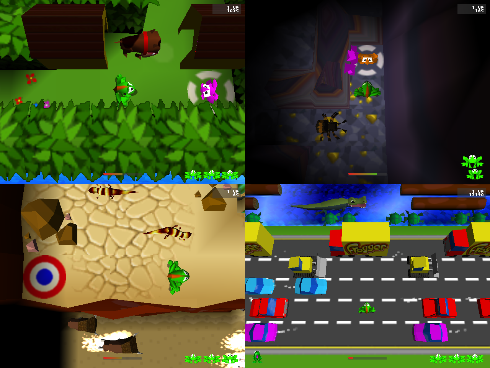
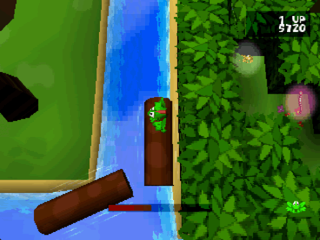
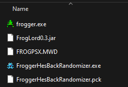
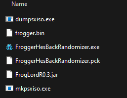

Powered by 

# Frogger He's Back Randomizer

## v0.3 Trailer

`>>` https://www.youtube.com/watch?v=dQK81khEZcg `<<`

## How does it work?

The randomizer scrambles player starting position and froglet 
locations in each level allowing you to experience the levels
from a new perspective.  Explore new paths.  Develop new
strategies.

The randomizer requires a copy of Frogger: He's Back (1997)
to run.

> ✅ New in v0.3, PSX is now supported in addition to the PC version!

# Setup

> ⚠️ The randomizer has only been tested on Windows devices.  Mac and Linux support is not guaranteed.
> If you try these out, do share whether they work!

## 1. Install Java 8 JDK

This version of the Randomizer still runs on Java 8.  You can install the Java 8 JDK provided by
[OpenJDK](https://www.openlogic.com/openjdk-downloads?field_java_parent_version_target_id=416&field_operating_system_target_id=436&field_architecture_target_id=391&field_java_package_target_id=396).

The randomizer has been tested with versions 8u442-b06 and 8u262-b10, but other versions likely work as well.
Start with the latest available and try an older version if that one fails.

## 2. Download the Randomizer

Download the latest version of the randomizer from the [Releases Page](https://github.com/jmpoholarz/HesBackRandomizer/releases).
You will need all three files under `Assets`.  

Place these files together in a folder, from here referred to as your **BASE_PATH**.

Proceed to PC or PSX directions depending on your version of the game.

## PC

### 3. Locate FROGPSX.MWD and Frogger.exe files

The randomizer needs access to two files that come with your PC installation of Frogger.

Copy both `FROGPSX.MWD` and `Frogger.exe` to your **BASE_PATH** directory which should now contain the following:

> ⛔ Avoid using any spaces in **BASE_PATH** if possible.  There's a known bug with the randomizer where
> spaces will break some of the automatic file renaming.

### 4. Launch the Randomizer

Open `FroggerHesBackRandomizer.exe` and customize the settings to your liking.

Navigate to **BASE_PATH** in the `Base Path` file selection window.  Then click the `Randomize` button.

When the FrogLord window opens, select `Frogger: He's Back` in the `Game` dropdown.

Select your version in the `Version` dropdown.  If you're unsure, try `PC Retail v1.0 (UK)` or the `v3.0` options.

Provide your `FROGPSX.MWD` and `Frogger.exe` files to the next two file select prompts.

Finally, hit `Load`.  The randomizer will launch and update your files.

### 5. Copy Randomized FROGPSX.MWD and Frogger.exe back to Install Directory

Once FrogLord exits, you will see some new files in your **BASE_PATH** directory.

- `frogger.exe.bck` : This is an unmodified copy of your `frogger.exe` file.
- `FROGPSX.MWD.bck` : This is an unmodified copy of your `FROGPSX.MWD` file.
- `seed.txt` : This contains the seed number used to generate your files.  If you encounter any bugs, be sure to share the seed.

The `frogger.exe` and `FROGPSX.MWD` will be updated with the randomization in place.  Copy these back to your
Frogger installation directory, and launch the game as you would normally!

To generate another seed, you can rename `frogger.exe.bck` back to `frogger.exe` and `FROGPSX.MWD.bck` back to
`FROGPSX.MWD` and run the randomizer again.

## PSX

### 3. Locate Frogger (Track 1).bin

Your PSX Frogger disc likely contains three files: `Frogger (Track 1).bin`, `Frogger (Track 2).bin`, and 
`Frogger.cue`.  The Track 1 bin file contains the game files needed for the randomizer.  Copy this to your
**BASE_PATH** directory and rename it to `frogger.bin`

### 4. Download dumpsxiso.exe and mkpsxiso.exe

The PSX files are packed into the `.bin` file and need to be extracted for the Randomizer to edit them.

Download [mkpsxiso-2.10-win64.zip](https://github.com/Lameguy64/mkpsxiso/releases/tag/v2.10), and extract
to find `dumpsxiso.exe` and `mkpsxiso.exe` in the bin folder.  Move these to your **BASE_PATH**.

### 5. Launch the Randomizer

Open `FroggerHesBackRandomizer.exe` and customize the settings to your liking.

Navigate to **BASE_PATH** in the `Base Path` file selection window.  Then click the `Randomize` button.

When the FrogLord window opens, select `Frogger: He's Back` in the `Game` dropdown.

Select your version in the `Version` dropdown. 
If you're unsure, try `PSX Master USA [NTSC/SLUS-00506] (Build 71)` or `PSX Master EUR [PAL/SLES-00704] (Build 75)`.

You may have noticed the randomizer extracted `frogger.bin` into a new `frogger` folder.
In the next two file select prompts, select `FROGPSX.MWD` and then `SLUS_005.06` from this new folder.

Finally, hit `Load`.  The randomizer will launch, make its changes, and repack your files.

### 6. Copy Files Back

Once FrogLord exits, you will see some new files in your **BASE_PATH** directory.

- `frogger_randomized.bin` : This is a new packed image with the included randomizer changes.  You can run this like you would run the original `Frogger (Track 1).bin`. 
- `seed.txt` : This contains the seed number used to generate your files.  If you encounter any bugs, be sure to share the seed.

To generate another seed, you can run the randomizer again.  Note that it will automatically overwrite
the relevant files.

# Troubleshooting

The Randomizer interface may provide error text if something goes wrong.  If you're unable to determine the
problem, check the `C:\Users\<User>\AppData\Roaming\Godot\app_userdata\HesBackRandomizerGUI\logs` directory
(accessible if you search `%appdata%` in the file explorer) for the full log output.

> ⚠️ You may need to close the Randomizer GUI for the log file to appear.

## Also Visit:
https://github.com/Kneesnap/FrogLord/releases

https://highwayfrogs.net/

https://highwayfrogs.net/thread/26/discord-group

### Join the Community: 
Need help? Want to find/share mods? Talk with other Frogger fans? Join our [discord server](https://discord.gg/GSNCbCN).

-----

## Build Instructions:

### Using IntelliJ and Godot 4.3

**Setup:**
1. Select ``Git`` from the ``Check out from Version Control`` option on the main menu. (It may be ``File > New > Project from Version Control`` if you're not on the main menu.)  
2. Clone this repository. 
3. Install the Lombok IntelliJ Plugin using the steps 
found [here](https://projectlombok.org/setup/intellij).

**Running:**
1. Comment out `// Save the end result` section of Randomizer.java
2. ``Run > Run 'FrogLord GUI'``  

**Building:**
1. ``Build > Build Artifacts... > FrogLord > Build``
2. Copy from `out` folder to designated release directory
3. Open HesBackRandomizerGUI with Godot
4. `Project > Export > Windows Desktop (Runnable)`
5. Update the version number and output path
6. `Export all...`

### Using Maven

**Requirements:**
1. Maven:
    - Download the latest version of [maven](https://maven.apache.org/download.cgi)
    - Follow the [installation guide](https://maven.apache.org/install.html)
2. Java JDK:
    - Make an Oracle account (Unfortunately required for the next step)
    - Download Java 8 [Java Development Kit](https://www.oracle.com/java/technologies/javase/javase8u211-later-archive-downloads.html)
    - If you downloaded a bin file run that, otherwise install according to the instructions

**Setup:**
1. ``git clone https://github.com/Kneesnap/FrogLord.git``
2. ``cd FrogLord``
3. ``mvn compile`` - Verify code compiles

**Building:**
1. ``mvn package``

**Running:**
1. ``java -jar target/editor-{version}-jar-with-dependencies.jar`` 
    * `{version}` is the current release

## Special Thanks:
 - Kneesnap (FrogLord creator who made this randomizer possible)
 - Andy Eder (Frogger 2 Programmer, Significant FrogLord contributor)
 - Mysteli (Highway Frogs Creator, Documented demo replay file format)
 - Aluigi (QuickBMS Author, Wrote a BMS script which we analyzed to understand the MWD and MWI file formats)
 - Shakotay2 (XeNTax, Helped us figure out how 3D geometry was stored)

